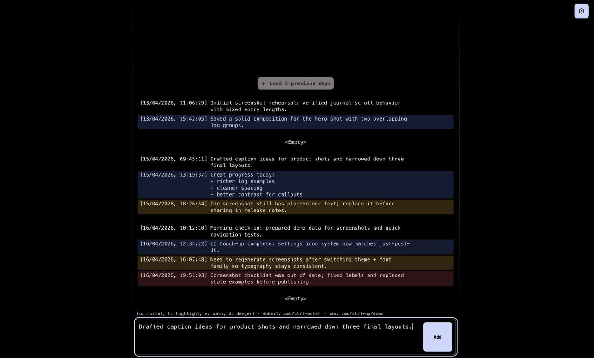

# Logs

Standalone local-first logbook.

The app is intentionally narrow: authenticate with a shared password, write short logs fast, review them by day, delete/copy entries, and export everything as JSON.

[Changelog](./CHANGELOG.md)

<p align="center">
  
</p>

## Highlights

- Next.js App Router app with no external database service.
- File-based storage in JSON files under `contents/logs`.
- Day-grouped journal UI with a sticky composer.
- Incremental history loading (`Load 10 previous days`).
- Log kinds: `normal`, `highlight`, `warn`, `danger`.
- Copy and delete actions for each entry.
- Full JSON export endpoint.

## Stack

- Next.js 16
- React 19
- TypeScript
- JSON Web Token authentication (`jsonwebtoken`)

## Requirements

- npm
- node >= 20
- pm2

## Installation

1. Install dependencies:

```bash
npm install
```

2. Create your local env file:

```bash
cp .env.example .env
```

3. Set required values in `.env`:

- `PORT`: production port used by pm2 launch (default `4015`)
- `PASSWORD`: login password required by `/api/login`
- `JWT_SECRET`: secret used to sign auth tokens
- `JWT_DURATION`: token duration in days (default `90`)

4. Run the app locally:

```bash
npm run dev
```

5. Open:

```text
http://localhost:4015
```

## Launching With pm2

Still in the `logs` folder:

```bash
npm run launch
```

To update a deployed instance with the same workflow as `just-post-it`:

```bash
npm run update
```

## Scripts

- `npm run dev`: start development server on port `4015`
- `npm run build`: production build
- `npm run start`: start production server on port `4015`
- `npm run lint`: run ESLint
- `npm run launch`: install deps, build, and start/restart with pm2
- `npm run update`: stop pm2 app, refresh from git, and relaunch
- `npm run typecheck`: run TypeScript checks only

## Data Storage

- Logs are stored as one JSON file per day in `contents/logs/YYYY-MM-DD.json`.
- `contents` is gitignored.
- Each file contains an array of log entries with this shape:

```json
{
  "id": 1,
  "kind": "normal",
  "content": "Example",
  "createdAt": "2026-04-16T18:25:34.344Z",
  "updatedAt": "2026-04-16T18:25:34.344Z"
}
```

## API Endpoints

- `POST /api/login`
  - Body: `{ "password": "..." }`
  - Returns `{ "token": "..." }` when credentials are valid.

- `GET /api/logs`
  - Query params:
    - `days`: number of days in window (default `7`, min `1`, max `30`)
    - `reference`: window end date (`YYYY-MM-DD`)
    - `q`: optional content search
    - `kinds`: optional comma-separated kinds (`warn,danger`)
  - Returns day groups with metadata and counters.

- `POST /api/logs`
  - Body: `{ "kind": "normal" | "highlight" | "warn" | "danger", "content": "..." }`
  - Creates one log entry.

- `DELETE /api/logs/:id?date=YYYY-MM-DD`
  - Deletes one log entry from the given day file.

- `GET /api/logs/export`
  - Returns JSON attachment:
    - `exportedAt`
    - `count`
    - `logs` (newest first)

## Notes

- Node runtime is required for auth and filesystem-backed API routes.
- This app is designed for local/self-hosted environments with persistent filesystem access.

## License

GPL-3.0 License. See [LICENSE](LICENSE) for details.
